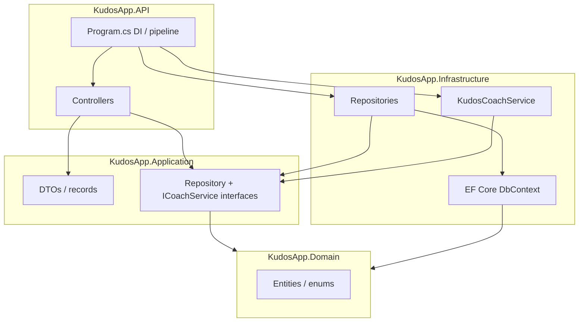
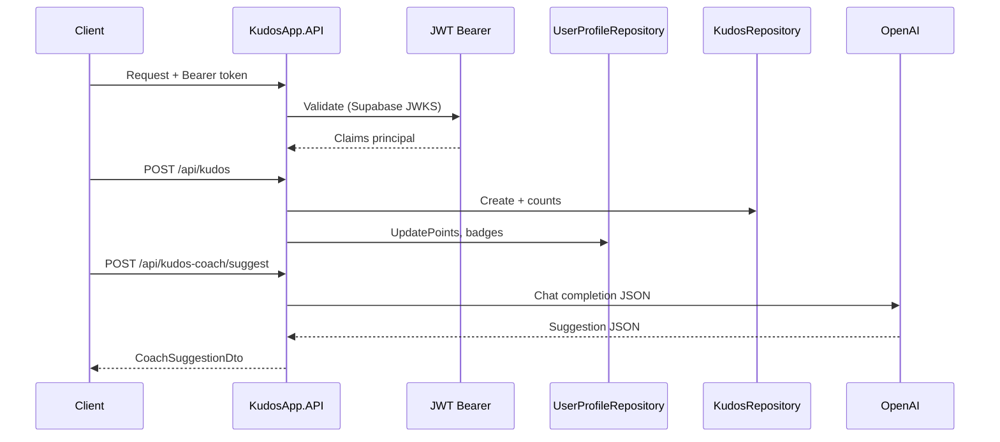

# KudosApp — Backend

.NET **ASP.NET Core** API for **KudosApp**: peer-to-peer employee recognition with Supabase JWT authentication, PostgreSQL (EF Core), and optional **OpenAI**-powered **Kudos Coach** suggestions.

---

## Tech stack

| Area | Technology |
|------|------------|
| Runtime | **.NET 8**, **C# 12** |
| API | **ASP.NET Core** (controllers, minimal hosting model) |
| Data | **EF Core 8**, **Npgsql** (PostgreSQL) |
| Auth | **JWT Bearer** — Supabase OIDC (`/auth/v1`), `MapInboundClaims = false` for raw JWT claims |
| HTTP client | **IHttpClientFactory** — typed client for OpenAI |
| Docs | **Swagger** / OpenAPI |

---

## Architecture decisions

1. **Clean Architecture** — Dependencies point **inward**: `API` → `Application` + `Infrastructure`; `Application` defines interfaces; `Infrastructure` implements persistence and external services; `Domain` has entities and enums only.
2. **Repository pattern** — Controllers depend on `I*Repository` abstractions; **no `DbContext` in controllers**.
3. **Supabase-aligned identity** — `UserProfile.Id` matches `auth.users.id` (UUID). Tokens validated against Supabase’s authority; audience `authenticated`.
4. **Kudos Coach** — `ICoachService` in Application; `KudosCoachService` in Infrastructure calls OpenAI; returns structured JSON mapped to `CoachSuggestionDto`. Empty/missing API key yields a **fallback** suggestion (offline coach).
5. **Badge milestones** — Awarded on first give/receive (transaction counts); **`GET /api/auth/me`** and **`sync-profile`** call **`EnsureMilestoneBadgesAsync`** to backfill if history predates the feature.
6. **Leaderboards** — Ranked by **sum of points** (then kudos count) for top givers and receivers.

### Layer diagram



### Request pipeline (auth + kudos)



---

## AI tools used and features implemented

| Feature | Description |
|--------|-------------|
| **Kudos Coach** | `POST /api/kudos-coach/suggest` — builds prompt with active categories; OpenAI `gpt-4o-mini` with `response_format: json_object`; parses into `CoachSuggestionDto`. Prompt artifacts live under repo `ai-prompts/`. |
| **Development** | Cursor / Claude Code assisted with layering, JWT claim mapping (`sub`), badge backfill, leaderboard scoring, and docs. |

Implemented API areas:

- **Auth**: `POST /api/auth/sync-profile`, `GET /api/auth/me`, `PUT /api/auth/profile`
- **Kudos**: feed, create, categories, **leaderboard**
- **Users**: teammates list
- **Coach**: suggest endpoint
- **EF migrations** — schema for users, kudos, categories, badges

---

## Setup, prerequisites, and run

### Prerequisites

- **.NET 8 SDK**
- **PostgreSQL** reachable connection string (local or **Supabase** hosted DB)
- **Supabase** project: URL for JWT authority configuration
- Optional: **OpenAI API key** for live Kudos Coach (`OpenAI:ApiKey`)

### Configuration

Use `KudosApp.API/appsettings.json` / **`appsettings.Development.json`** (gitignored for secrets) with:

| Key | Purpose |
|-----|---------|
| `ConnectionStrings:DefaultConnection` | Npgsql connection string |
| `Supabase:Url` | e.g. `https://<project>.supabase.co` (must match frontend project) |
| `OpenAI:ApiKey` | Optional; omit or empty for fallback coach |

JWT validation uses `{Supabase:Url}/auth/v1` as authority.

### Database

From repo root (or `backend/`):

```bash
cd backend
dotnet ef database update \
  --project KudosApp.Infrastructure \
  --startup-project KudosApp.API
```

*(Or rely on dev startup auto-migrate if enabled in `Program.cs`.)*

### Run API

```bash
cd backend
dotnet run --project KudosApp.API
```

Default HTTP profile: **http://localhost:5235** — Swagger typically at `/swagger`.

### Build

```bash
cd backend
dotnet build
```

---

## Project layout (abbreviated)

```
backend/
├── KudosApp.API/           # Controllers, Program.cs, Auth helpers
├── KudosApp.Application/   # DTOs, interfaces
├── KudosApp.Domain/        # Entities
├── KudosApp.Infrastructure/# EF Core, repositories, KudosCoachService
└── README.md
```
