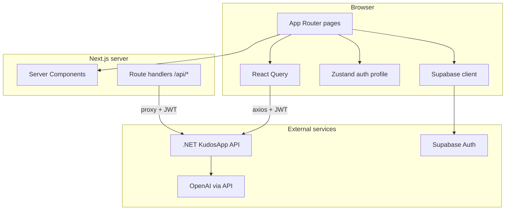
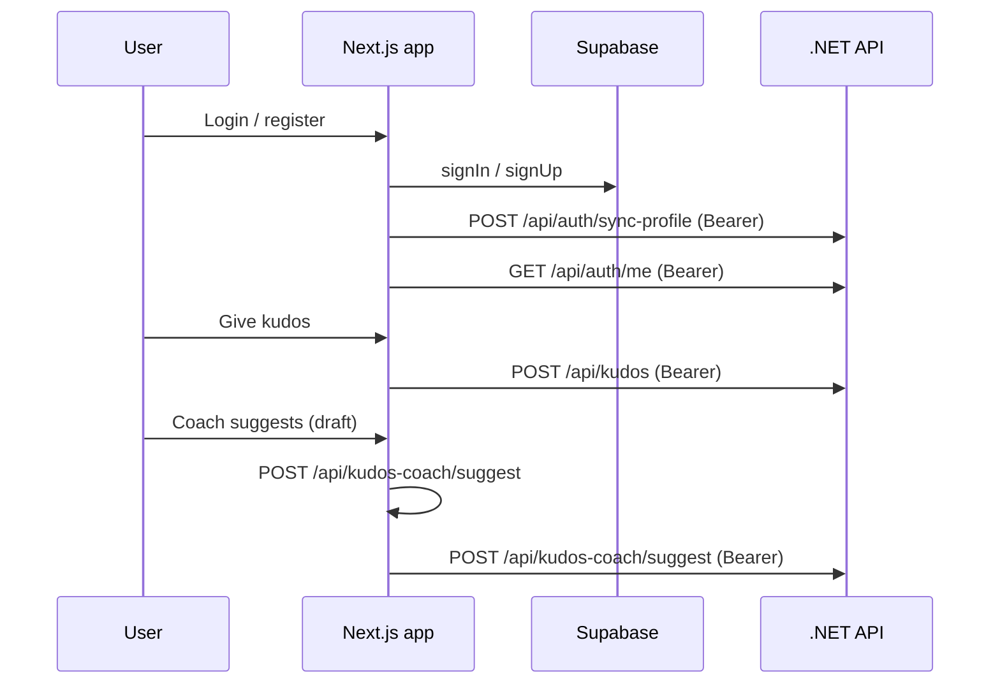

# KudosApp — Frontend

Next.js client for **KudosApp**, a peer-to-peer employee recognition platform. Users sign in with Supabase, give kudos, view the feed and leaderboards, and use **Kudos Coach** (AI-assisted message suggestions).

---

## Tech stack

| Area | Technology |
|------|------------|
| Framework | **Next.js 16** (App Router) |
| UI | **React 19**, **Tailwind CSS 4**, **shadcn/ui**-style primitives (Radix) |
| Auth | **Supabase** (`@supabase/ssr`, `@supabase/supabase-js`) |
| Data fetching | **TanStack React Query** |
| HTTP | **Axios** (API + token refresh); **Fetch** for streaming coach proxy |
| Forms | **react-hook-form**, **Zod**, **@hookform/resolvers** |
| State | **Zustand** (auth profile cache) |
| Motion | **Framer Motion** (landing, feed polish) |
| Icons | **lucide-react** |
| Toasts | **Sonner** (via project toast helper) |

---

## Architecture decisions

1. **App Router only** — Server Components by default; `'use client'` only where hooks, browser APIs, or Framer Motion require it.
2. **Supabase session in the browser** — Axios interceptor attaches the JWT to the .NET API; 401 triggers session refresh when possible.
3. **BFF-style coach route** — `POST /api/kudos-coach/suggest` in Next forwards the body and `Authorization` to the .NET API so the client can use same-origin `fetch` and read a streaming JSON body.
4. **React Query for server state** — Feed, categories, teammates, leaderboard, and `/api/auth/me` use stable query keys and cache invalidation (e.g. after creating kudos).
5. **Marketing vs app shell** — `/` is a public marketing page; `(dashboard)` routes use `AppShell` (sidebar + top bar). Auth routes `(auth)/login` and `(auth)/register` are minimal full-screen layouts.
6. **Design tokens** — Dark theme with purple accent; `DM Sans` via `--font-sans` from root layout.

### High-level diagram



### Request flows (simplified)



---

## AI tools used and features implemented

| Feature | Role of AI / tooling |
|--------|----------------------|
| **Kudos Coach** | Backend calls OpenAI (`json_object` response) with category context; optional `ai-prompts/prompts/kudos-coach-system.md` documents the product prompt. UI debounces drafts and streams the JSON response through the Next proxy. |
| **Landing page** | Marketing copy and layout were iterated with AI-assisted design (Framer Motion hero, coach mock). |
| **General development** | Cursor / Claude Code assisted with scaffolding, auth edge cases (JWT claims, session guards), and READMEs. |

Implemented product features on the frontend include:

- Public **landing** (`/`), **login** / **register** with “Back to home”
- **Dashboard**: feed, stats, sidebar leaderboard, **Your Badges**
- **Give Kudos**: teammate search, categories, message, **CoachPanel**
- **Profile** (`/profile/[id]`): edit display name and avatar URL (own user only)
- **Proxy config** (`src/proxy.ts`): public `/` and auth routes when used as middleware

---

## Setup, prerequisites, and run

### Prerequisites

- **Node.js 20+** (recommended for Next.js 16)
- **npm** (or compatible package manager)
- Running **KudosApp .NET API** (see `../backend/README.md`) and a **Supabase** project

### Environment

Copy `.env.example` to `.env.local` and set:

| Variable | Purpose |
|----------|---------|
| `NEXT_PUBLIC_SUPABASE_URL` | Supabase project URL |
| `NEXT_PUBLIC_SUPABASE_PUBLISHABLE_KEY` | Supabase anon / publishable key |
| `NEXT_PUBLIC_API_URL` | Base URL of the .NET API (e.g. `http://localhost:5235`) |

Optional for server-side API proxy defaults: `API_URL` (falls back to `NEXT_PUBLIC_API_URL`).

### Install and dev server

```bash
cd frontend
npm install
npm run dev
```

App: **http://localhost:3000**

### Production build

```bash
npm run build
npm start
```

### Lint

```bash
npm run lint
```

---

## Project layout (abbreviated)

```
frontend/
├── src/
│   ├── app/                 # App Router: (auth), (dashboard), api/, page.tsx
│   ├── components/        # UI + feature components (kudos, layout, auth)
│   ├── hooks/             # useAuth, useKudos, useProfile, useDebounce, …
│   ├── lib/               # api client, supabase, utils, uiIcons
│   ├── store/             # Zustand auth store
│   └── types/             # Shared TypeScript types
├── public/
├── package.json
└── README.md
```
